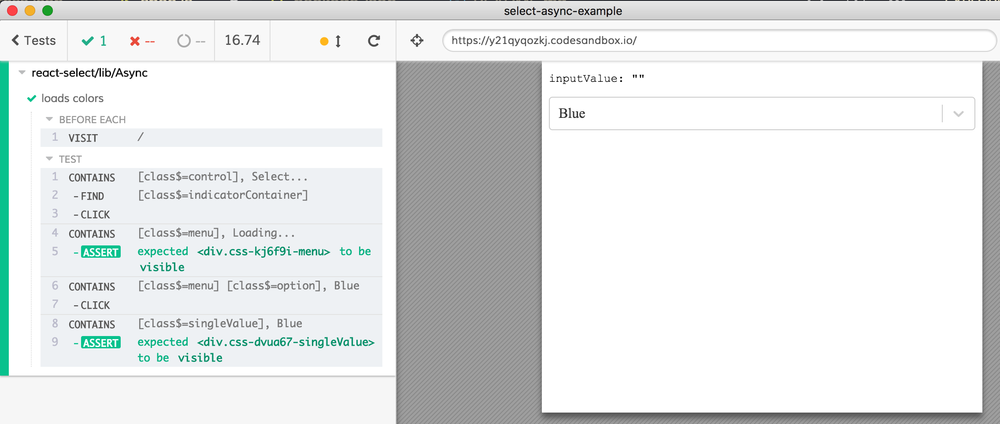

Example waiting for async select component to appear before picking "Blue" color

Component from https://codesandbox.io/s/y21qyqozkj

Test in [cypress/integration/spec.js](cypress/integration/spec.js)

**Tip:** read [Cypress retry-ability guide](https://on.cypress.io/retry-ability) to understand how Cypress retries commands until an assertion that follows it passes.
